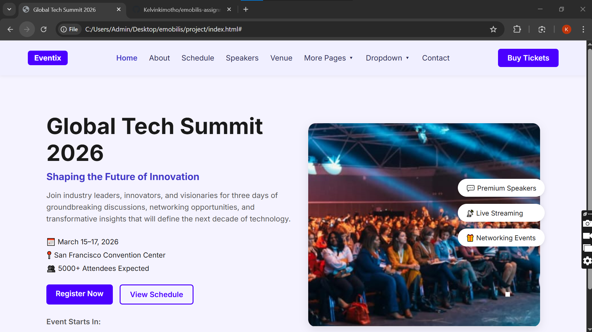

# 🌐 Global Tech Summit 2026 — eMobilis Web Dev Assignment 1

This is my **first web development assignment** for the **eMobilis Web Development Course**.  
The task was to recreate a modern event landing page using **pure HTML and CSS**, inspired by the *Global Tech Summit 2026* concept.

---

## 🚀 Project Overview

The page is a **one-screen landing page** that showcases details for an upcoming tech summit.  
It features a navigation bar, hero section, event details, and promotional tags — all styled to closely match a provided design.

### ✨ Key Features
- Responsive layout using **HTML5 + CSS3**
- Clean and modern design inspired by real-world event pages
- Hero section with **call-to-action buttons**
- Floating **event feature tags**
- Custom **color palette and typography**
- Organized and easy-to-read code structure

---

## 🛠️ Tech Stack

| Technology | Purpose |
|-------------|----------|
| **HTML5** | Page structure |
| **CSS3** | Styling and layout |

---

## 📸 Screenshot of my page view on browser


---

## 💻 How to Run Locally

Follow these steps to view the project on your computer:

1. **Clone the Repository**
   ```bash
   git clone https://github.com/Kelvinkimotho/emobilis-assignment1.git

2. Open the Project Folder

cd emobilis-assignment1-global-tech-summit

3. Open in Browser

Locate the index.html file

Double-click it to open in your default browser, or

Right-click → “Open with Live Server” (if using VS Code)